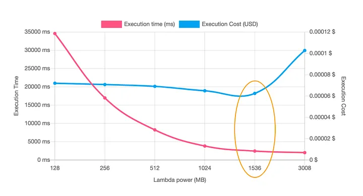

> _This is a translated crosspost from my original article on Medium. You can read the original (in Portuguese) [here](https://medium.com/@prandogabriel/aprendizados-e-li%C3%A7%C3%B5es-ap%C3%B3s-2-anos-trabalhando-com-serverless-em-projetos-distribu%C3%ADdos-de-alto-2281163edb06)._

# Lessons and Learnings After 2 Years Working with Serverless in Large Distributed Projects
Over the past 2 years, I've been working heavily with serverless using AWS Lambda with Node.js (TypeScript) and Go. During this time, I've been able to use various AWS technologies and services in day-to-day projects, such as API Gateway, SQS, SNS, Step Functions, S3, SES, DynamoDB, Aurora, IAM, CloudFront, Secrets Manager, KMS, CloudWatch, CloudFormation, and others (many of these, or almost all of them, also run on the serverless concept).

I'm writing this post based on my daily experiences, keeping in mind that this applies to my reality and that other people may have had different experiences than mine.

## But after all, what is serverless?
Serverless is a technology that has grown in recent years because developers don't need to manage a server, since this responsibility is delegated to a cloud provider. This means that developers can focus on solving specific problems, while the cloud provider takes care of infrastructure, scaling, and maintenance. This serverless computing model is considered more efficient and scalable than traditional server hosting models, as computational resources are provisioned on demand and developers only pay for the time their code is executing. Additionally, the adoption of microservices and container-based architectures has made it easier for developers to adopt the serverless model in their applications, which has led to an increase in the popularity of this technology in recent years.

Many startups have been using Lambda or some other FaaS (Function as a Service) resource to launch their MVP, due to its very low cost when their application has low customer traffic and high elasticity in case they need to scale their service several times over from one day to the next.RetryClaude can make mistakes. Please double-check responses.

## What are the reasons and benefits of using it?
There are many benefits to using serverless, including:

- *Enhanced developer productivity:* as noted above, it allows development teams to focus on writing code, not managing infrastructure. It gives developers more time to innovate and optimize application functionality.
- *Cost reduction:* The meter starts when the request is made and ends when execution completes, the server is charged only when in use, with no fixed fees. Compare this to the Infrastructure as a Service (IaaS) computing model, where customers pay for physical servers, virtual machines (VMs), and other resources needed to run applications, from the moment they provision these resources until they are explicitly deactivated.
- *Scalability:* allows applications to scale automatically to meet demand.
- *Develop in any language:* It's a polyglot environment, allowing developers to code in any language or framework — Java, Python, JavaScript, Node.js, Golang — that they're comfortable with.
- *Simplified development/DevOps cycles:* Simplifies deployment and, in a broader sense, simplifies DevOps because developers don't spend time defining the infrastructure needed to integrate, test, deliver, and deploy code builds to production.

## What have I learned during this time?
Throughout all this time working, I've had various challenges in my day-to-day work. Serverless is still a largely unexplored world, with little good quality material available on the internet, so I try to bring here some important points I've learned in my journey.

- *Understand that everything is a function and start thinking about everything based on events:* Serverless is function-based, so it's important to understand that everything that runs is a function. Additionally, it's event-based, so it's important to start thinking about everything as if it were an event, something that based on some occurrence, will generate an action and result.

- *Understand what cold start and function context are:* When a Lambda receives a request to execute, AWS downloads the function code stored in an internal S3 bucket, creates an environment with the specified configurations, and then executes it. This environment remains active for other requests for a period X, so subsequent executions don't suffer from this environment preparation delay.

- *Use a framework to increase productivity:* While we can develop without a framework and deliver our code via CloudFormation, for example, directly on AWS, using a framework will help you tremendously in daily work, both in deployments and other routine development tasks.
- *Use technologies from your cloud provider:* This can avoid cold starts. It's not a rule, but generally tools from your own provider will integrate better and have better response times.
- *Be careful with your function permissions:* Whenever code is executed, to access other resources within the provider, we need policies and roles, so be careful to configure correctly, granting access to your function only for what is necessary.
- *Use as many tools as possible to run and test your applications locally:* One of the biggest difficulties I felt at the beginning was how to test the code I was developing, since in theory the only way to test is by uploading your code to the cloud. However, depending on the framework you're using, you can test your code locally. For the Serverless Framework, we have the serverless-offline plugin that simulates a server and exposes functions via HTTP for testing. SAM also has this natively. If you're using CloudFormation to create your functions "natively," you can use LocalStack to spin up a local AWS infrastructure and test your resources.
- *Prefer asynchronous integrations whenever possible:* One of the factors affecting your operation cost is execution time, so always prefer asynchronous integrations, avoid having your functions wait for returns from other services. Another point is to decouple your services.
- *Make small functions and generate packages with only what's necessary:* Try to use few third-party packages and avoid loading useless code into your functions. Also remember to use package optimizers, this will help reduce storage-related costs and also help with performance when executing your functions, because the smaller your function package, the shorter the loading and execution start time (especially for cold starts).
- *Monitoring and debugging functions is difficult and one of the biggest challenges:* Without a doubt, this is one of the biggest challenges. When using Lambda on AWS, we have a simple log indexer for them, CloudWatch, but it's certainly quite limited. We need to use good log patterns for our queries to work properly. Another point that's somewhat limited is log aggregation across multiple functions. Investigating problems through CloudWatch can be difficult if you don't structure your logs properly.
- *Log only what is necessary:* This will help in the problem discovery process, as it will be easier to find what you need. Another important point is that you have a cost for storing your logs, so I suggest logging what makes sense, and also apply deletion policies for old logs.
- *Use cache wherever you can:* Remember, the shorter the response time, the better for the end user and for you who will pay the bill later. Use cache wherever you can to improve performance and reduce costs. The simplest way to apply cache without any cost is through the context that is shared between Lambda executions - a simple, easy, and cheap in-memory cache.
- *Avoid long-running routines and jobs:* Consider using virtual machines when you need to execute routines with large workloads, as execution time in Lambda is expensive.
- *Use and abuse Infrastructure as Code:* Use IaC to create your functions and all their related resources to ensure consistency and ease of management.
- *Do automated testing, unit tests are the most important:* Integration testing is somewhat complex when you have a distributed architecture running on serverless, so if you can't do integration testing, prioritize unit tests, as they are simpler, faster to implement and maintain.
- *Security is very important:* Only expose what is really necessary to ensure the security of your applications. If you have services that are only used by other services and don't need to be exposed on the internet, consider using a VPC (Virtual Private Cloud) for these functions.
- *Configure the correct amount of memory in your Lambdas:* By default, Lambdas have 512MB of memory, but they don't always (almost never) need all of that. You can easily query CloudWatch and get average, maximum, and minimum memory usage metrics for each Lambda, very useful for correctly sizing your Lambdas and thus saving on your bill. Another tip is to use AWS Lambda Power Tuning, which spins up a machine in Step Functions and runs some workloads on a specific function, then delivers a report with the appropriate amount of memory for the function.

- *Document your endpoints and architecture:* Use tools to design and document your function architecture, because as your architecture grows, it becomes increasingly difficult to manage and remember what each component does. If you're using API Gateway, you can view all declared endpoints and also export OpenAPI or Swagger definitions directly from API Gateway.

I hope these lessons can help you in your day-to-day work with serverless and AWS Lambda. If you have any other lessons you've learned while working with serverless, share them in the comments below. Thanks for reading!

### Want to stay updated?
Follow me on [LinkedIn](https://www.linkedin.com/in/prandogabriel/) or check out my [GitHub](https://github.com/prandogabriel/) for more content. 🚀 